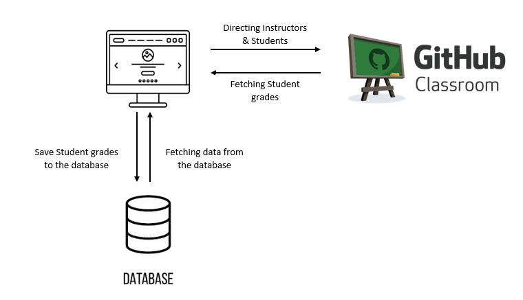
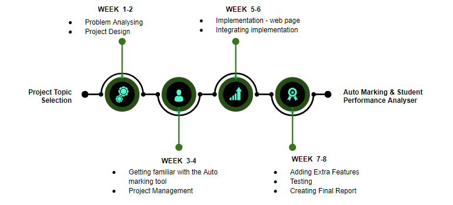

[comment]: # "This is the standard layout for the project, but you can clean this and use your own template"

# Auto Marking and Student Performance Analyser System for Continuous Assessments

---

## Team
-  E/18/323, Seekkubadu H.D. [e18323@eng.pdn.ac.lk](mailto:e18323@eng.pdn.ac.lk)
-  E/18/330, Sewwandi H.R. [e18330@eng.pdn.ac.lk](mailto:e18330@eng.pdn.ac.lk)
-  E/18/375, Vindula K.P.A. [e18375@eng.pdn.ac.lk](mailto:e18375@eng.pdn.ac.lk)

## Supervisor

Dr. Mahanama Wickramasinghe [mahanamaw@eng.pdn.ac.lk](mailto:mahanamaw@eng.pdn.ac.lk)

## Scrum Master

Poornima Lankani [lankaniperera@eng.pdn.ac.lk](mailto:lankaniperera@eng.pdn.ac.lk)

## Table of Contents
1. [Introduction](#introduction)
2. [Proposed Solution and its Scope](#proposed-solution-and-its-scope)
3. [High Level Plan of Reaching the Solution](#high-level-plan-of-reaching-the-solution)
4. [Project Timeline](#project-timeline)
5. [Links](#links)

---

### Introduction

 The Department of Computer Engineering uses many coding-based assignments for the continuous assessment of student learning. The instructors have to spend a lot of time manually marking these assignments which is not the ideal use of the instructors’ time. Under the current system, instructors have to manually go through each student's code to evaluate their performance.  As a result, Instructors have less time to spend on other student activities such as teaching.

Most coding assignments these days can be evaluated relatively well by using an Auto Grader. By giving a diverse set of test cases, codes written by a student can be evaluated well. 

So the motivation of this project is to create an Autograder which is capable of evaluating coding assignments submitted by students.

The other objective is to use the data generated by the auto grader to evaluate the student.  This data can be used to assess the students strengths and weaknesses.

### Proposed Solution and its Scope

Our solution to the above problem is to integrate an already existing Auto-Grading system to a web interface that allows to track the students' performances. 

The GitHub classroom will be used as the Auto-Grading tool. It has an inbuilt Autograder to evaluate codes written in most languages.

We will create a web interface to communicate with GitHub. The students can use all the inbuilt features of GitHub. This way Students can communicate with peers in group projects as well as post questions to the instructor via GitHub. The Instructor will be able to respond to these queries. They will also be able to see the overall performance of the students. The website will track the overall progress of the students and will display key information to the instructor. 

So the scope of this project is to Use and Autograder to evaluate the students and then use that information to analyze their performance.

### High Level Plan of Reaching the Solution

Here we create a web Interface to communicate with GitHub Classroom. The instructors as well as the students have access to this web interface. 

   - An Instructor first logs into this web Interface and navigates to the GitHub classroom to give an assignment to the students.
   
   - They can use the inbuilt features of GitHub classroom to give the assignment.
   
   - After creating the assignment the instructor can write multiple test cases to evaluate the student.
   
   - The students will be notified once a new assignment is created. They will have to navigate to the GitHub classroom via the web interface to complete the assignment.
   
   - If the student faces any difficulties in completing the assignment he can use GitHub features to send a message to the assigned instructor.
   
   - An API will deliver these messages to the web interface where the instructor can view and comment on them.
   
   - In addition, progress of the students will be shown to the instructor through the web interface.
   
   - The web interface will also display the strengths and weaknesses of each student to the instructor.
   
   - This information will be fetched from GitHub to the web interface via API. 
   
   - By analyzing the performance of each student, the instructor will be able to give feedback and help students to complete the assignments.
   
   - The overall data generated (Total marks of each student) will be saved in a database for future reference

### Project Timeline

## Links

- [Project Repository](https://github.com/cepdnaclk/e18-co227-Auto-Marking-and-Student-Performance-Analyser-System-for-Continuous-Assessments-Group-B)
- [Project Page](https://cepdnaclk.github.io/e18-co227-Auto-Marking-and-Student-Performance-Analyser-System-for-Continuous-Assessments-Group-B/)
- [Department of Computer Engineering](http://www.ce.pdn.ac.lk/)
- [University of Peradeniya](https://eng.pdn.ac.lk/)

[//]: # (Please refer this to learn more about Markdown syntax)
[//]: # (https://github.com/adam-p/markdown-here/wiki/Markdown-Cheatsheet)
